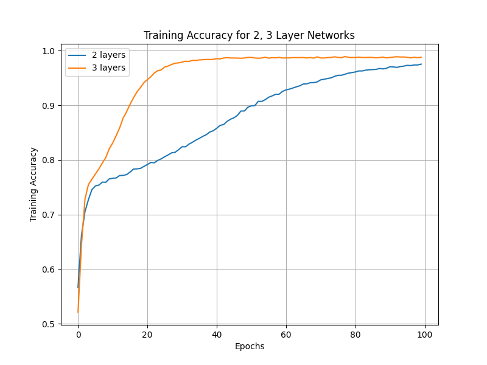
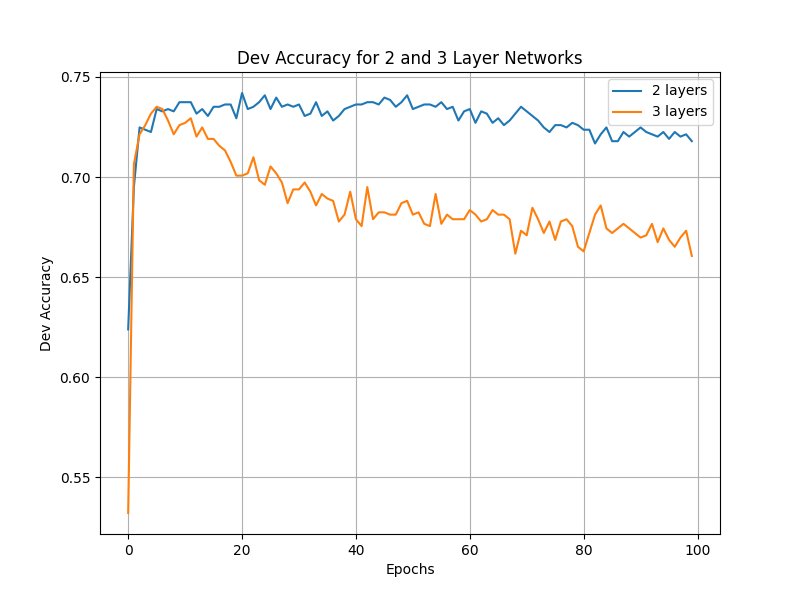

## Lab Report

### Part 2: Model and Results

#### 2a) Implementation Details

**Model Architecture**
- Implemented DAN class in `DANmodels.py` that inherits from `torch.nn.Module`
- Input: tokenized sentences converted to word indices
- Embedding layer: initialized with GloVe pretrained vectors (trainable)
- Sentence representation: average of word embeddings (masked by actual sentence length)
- Feedforward network: configurable hidden layers with ReLU activation and dropout
- Output: 2-class classification (positive/negative sentiment)

**Key Implementation Decisions**
1. **Embeddings**: Used GloVe 300d vectors (relativized) for best performance
2. **Hidden layers**: Single hidden layer of size 100 provided best balance
3. **Dropout**: 0.2 dropout applied after each hidden layer to prevent overfitting
4. **Optimizer**: Adam optimizer with learning rate 5e-4
5. **Loss function**: CrossEntropyLoss (expects raw logits)
6. **Training strategy**: Early stopping with patience=6 to prevent overfitting

**Hyperparameter Tuning**
We conducted extensive grid search over:
- Embeddings: 50d vs 300d GloVe
- Hidden layer configurations: [100], [200], [300], [200, 100]
- Dropout rates: 0.1, 0.2, 0.3
- Learning rates: 1e-3, 5e-4
- Embedding training: frozen vs fine-tuning

**Final configuration used with `python main.py --model DAN`**
- Embeddings: `glove.6B.300d-relativized.txt`
- Hidden sizes: `[100]`
- Dropout: `0.2`
- Learning rate: `5e-4`
- Batch size: `32`
- Max epochs: `10` (with early stopping)
- Freeze embeddings: `False` (fine-tuned during training)

**Results (dev accuracy)**

| Model | Embeddings | Init | Best Dev Acc | Best Epoch | Command |
| --- | --- | --- | --- | --- | --- |
| BOW (2-layer) | N/A | N/A | 0.732 | 10 | `python main.py --model BOW` |
| BOW (3-layer) | N/A | N/A | 0.722 | 10 | `python main.py --model BOW` |
| DAN | GloVe 300d | Pretrained | 0.818 | 4 | `python main.py --model DAN` |
| DAN | GloVe 300d | Random | 0.771 | 10 | `python main.py --model DAN --random-init` |
| DAN (custom) | GloVe 300d | Pretrained | 0.823 | 3 | `python DANmodels.py ...` |
| DAN (custom) | GloVe 300d | Random | 0.763 | 7 | `python DANmodels.py --random-init --embedding-dim 300` |

**Baseline Comparison**

The Bag-of-Words models (provided baseline) show clear overfitting:

- BOW 2-layer: peaks at 0.732 dev accuracy (epoch 10), then degrades
- BOW 3-layer: peaks at 0.722 dev accuracy (epoch 10), overfits more severely
- Both models memorize training data (>97% train accuracy) but fail to generalize

**DAN Performance**
- DAN with GloVe 300d achieves 0.818 dev accuracy at epoch 4
- Significantly outperforms BOW baseline (+8.6 points over best BOW)
- Training time: ~26 seconds for 10 epochs (well under 5 minutes)
- Converges much faster than BOW models

#### 2b) Random Initialization vs Pretrained Embeddings

**Experimental Setup**
- Same model architecture and hyperparameters
- Random init: embeddings initialized with PyTorch default (uniform distribution)
- Both configurations fine-tune embeddings during training

**Results Comparison**

| Configuration | Best Dev Acc | Best Epoch | Train Time |
| --- | --- | --- | --- |
| GloVe 300d (pretrained) | 0.818 | 4 | ~26s |
| Random init 300d | 0.771 | 10 | ~26s |
| Performance gap | -4.7% | | |

**Analysis**
1. **Convergence speed**: Pretrained embeddings converge in 4 epochs vs 10 for random init
2. **Final performance**: Random initialization underperforms by ~5 percentage points
3. **Generalization**: Both show early stopping helps, but pretrained starts from better position
4. **Learning dynamics**: Random init requires more epochs to learn semantic representations
   that GloVe already captures from large-scale pre-training

**Discussion**
- Pretrained GloVe embeddings provide strong initialization that captures semantic similarities
- Random initialization must learn word relationships from scratch with limited training data
- The SST dataset is too small to learn robust word embeddings from random initialization
- Fine-tuning pretrained embeddings combines benefits of transfer learning and task adaptation

